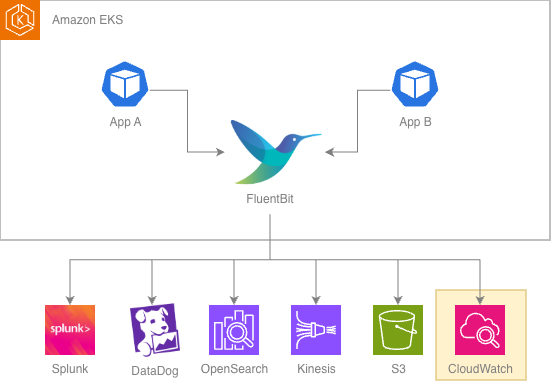

In this lab, we will configure [Fluent Bit](https://fluentbit.io/) logging agent as a DaemonSet in the EKS Auto Mode cluster.

Fluent Bit is a lightweight log processor and forwarder that allows you to collect data and logs from different sources, enrich them with filters and send them to multiple destinations like CloudWatch, Kinesis Data Firehose, Kinesis Data Streams and Amazon OpenSearch Service.

AWS provides a Fluent Bit image with plugins for both CloudWatch Logs and Kinesis Data Firehose. The [AWS for Fluent Bit](https://github.com/aws/aws-for-fluent-bit) image is available on the [Amazon ECR Public Gallery](https://gallery.ecr.aws/aws-observability/aws-for-fluent-bit).

Fluent Bit can be used to ship logs to various destinations. However, in this lab, we will see how it is leveraged to ship the container logs to CloudWatch.



In the following section, we will see how to validate Fluent Bit agent is already running as a DaemonSet to send the containers / Pods logs to CloudWatch Logs. Read more about how to [deploy Fluent Bit to send logs from containers to CloudWatch Logs](https://docs.aws.amazon.com/AmazonCloudWatch/latest/monitoring/Container-Insights-setup-logs-FluentBit.html#Container-Insights-FluentBit-troubleshoot).

First, we can validate the resources created for Fluent Bit by entering the following command. Each node should have one Pod:

```bash hook=get-all
$ kubectl get all -n amazon-cloudwatch -l app.kubernetes.io/name=aws-for-fluent-bit
NAME                           READY   STATUS    RESTARTS   AGE
pod/aws-for-fluent-bit-jg4jr   1/1     Running   0          94s
pod/aws-for-fluent-bit-lvp9f   1/1     Running   0          95s
pod/aws-for-fluent-bit-q959s   1/1     Running   0          94s

NAME                         TYPE        CLUSTER-IP      EXTERNAL-IP   PORT(S)    AGE
service/aws-for-fluent-bit   ClusterIP   172.16.41.165   <none>        2020/TCP   96s

NAME                                DESIRED   CURRENT   READY   UP-TO-DATE   AVAILABLE   NODE SELECTOR   AGE
daemonset.apps/aws-for-fluent-bit   3         3         3       3            3           <none>          96s
```

The ConfigMap for `aws-for-fluent-bit` is configured to stream the contents of files in the directory `/var/log/containers/*.log` from each node to the CloudWatch log group `/eks-workshop/worker-fluentbit-logs`.

```bash hook=desc-cm
$ kubectl describe configmap -n amazon-cloudwatch -l app.kubernetes.io/name=aws-for-fluent-bit
Name:         aws-for-fluent-bit
Namespace:    kube-system
Labels:       app.kubernetes.io/instance=aws-for-fluent-bit
              app.kubernetes.io/managed-by=Helm
              app.kubernetes.io/name=aws-for-fluent-bit
              app.kubernetes.io/version=2.31.12.20231011
              helm.sh/chart=aws-for-fluent-bit-0.1.32
Annotations:  meta.helm.sh/release-name: aws-for-fluent-bit
              meta.helm.sh/release-namespace: kube-system

Data
====
fluent-bit.conf:
----
[SERVICE]
    HTTP_Server             On
    HTTP_Listen             0.0.0.0
    HTTP_PORT               2020
    Health_Check            On
    HC_Errors_Count         5
    HC_Retry_Failure_Count  5
    HC_Period               5

    Parsers_File /fluent-bit/parsers/parsers.conf
[INPUT]
    Name              tail
    Tag               kube.*
    Path              /var/log/containers/*.log
    DB                /var/log/flb_kube.db
    multiline.parser  docker, cri
    Mem_Buf_Limit     5MB
    Skip_Long_Lines   On
    Refresh_Interval  10
[FILTER]
    Name                kubernetes
    Match               kube.*
    Kube_URL            https://kubernetes.default.svc.cluster.local:443
    Merge_Log           On
    Merge_Log_Key       data
    Keep_Log            On
    K8S-Logging.Parser  On
    K8S-Logging.Exclude On
    Buffer_Size         32k
[OUTPUT]
    Name                  cloudwatch_logs
    Match                 *
    region                us-west-2
    log_group_name        /aws/eks/eks-workshop/aws-fluentbit-logs-20250415195811907400000002
    log_stream_prefix     fluentbit-
...
```

Use the `kubectl logs` command to check the Fluent Bit Pod logs, where you will observe new CloudWatch Log groups and streams are created for the services.

```bash hook=pods-log
$ kubectl logs daemonset.apps/aws-for-fluent-bit -n amazon-cloudwatch

Found 3 pods, using pod/aws-for-fluent-bit-4mnbw
AWS for Fluent Bit Container Image Version 2.28.4
Fluent Bit v1.9.9
* Copyright (C) 2015-2022 The Fluent Bit Authors
* Fluent Bit is a CNCF sub-project under the umbrella of Fluentd
* https://fluentbit.io

[2025/04/14 16:15:40] [ info] [fluent bit] version=1.9.9, commit=5fcfe330e5, pid=1
[2025/04/14 16:15:40] [ info] [storage] version=1.3.0, type=memory-only, sync=normal, checksum=disabled, max_chunks_up=128
[2025/04/14 16:15:40] [ info] [cmetrics] version=0.3.7
...
[2025/04/14 16:15:40] [ info] [filter:kubernetes:kubernetes.0] connectivity OK
[2025/04/14 16:15:40] [ info] [sp] stream processor started
[2025/04/14 16:15:40] [ info] [output:cloudwatch_logs:cloudwatch_logs.0] worker #0 started
...
[2025/04/14 16:16:01] [ info] [output:cloudwatch_logs:cloudwatch_logs.0] Creating log stream ui-8564fc5cfb-54llk.ui in log group /aws/eks/fluentbit-cloudwatch/workload/ui
[2025/04/14 16:16:01] [ info] [output:cloudwatch_logs:cloudwatch_logs.0] Log Group /aws/eks/fluentbit-cloudwatch/workload/ui not found. Will attempt to create it.
[2025/04/14 16:16:01] [ info] [output:cloudwatch_logs:cloudwatch_logs.0] Creating log group /aws/eks/fluentbit-cloudwatch/workload/ui
[2025/04/14 16:16:01] [ info] [output:cloudwatch_logs:cloudwatch_logs.0] Created log group /aws/eks/fluentbit-cloudwatch/workload/ui
[2025/04/14 16:16:01] [ info] [output:cloudwatch_logs:cloudwatch_logs.0] Creating log stream ui-8564fc5cfb-54llk.ui in log group /aws/eks/fluentbit-cloudwatch/workload/ui
[2025/04/14 16:16:01] [ info] [output:cloudwatch_logs:cloudwatch_logs.0] Created log stream ui-8564fc5cfb-54llk.ui
```

In the next lab, we will verify these logs in CloudWatch.
